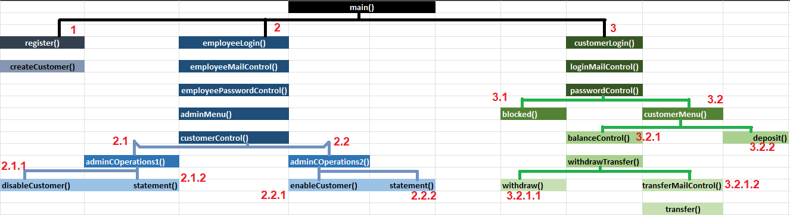

#JavaSE "BANKA OTOMASYONU" Staj Çalışması

##Başlarken

Bu proje, bir bankanın üşteri ve çalışanları için geliştirilmiş, müşterilerin para yatırabileceği, çekebileceği ve transfer edebileceği, çalışanların ise müşterilerin hesap dökümlerini izleyebileceği ve müşterileri aktif ya da pasif hale getirebileceği bir JavaSE konsol uygulamasıdır.

####Kullanılan diller
* Java (SE)
* SQL (MySQL)
####Kullanılan programlar
* IntelliJ IDEA 2021.3.3
* XAMPP

##Programın Çalışma Biçimi

Sistemin ön ve arka yüzünü oluşturan temel metotlar ve bu metotların ait oldukları sınıflar Görsel_1 de belirtilmiştir.

Görsel_ 2, Görsel_1 de verilen metotlar arasında ki bağı göstermektedir.

###Görsel_2 de gerçekleşen olaylar

Program main() metoduyla başlatılır.

####1 - register()

Bu method ile müşteriden "isim, soyisim, mail, şifre" bilgileri istenir ve girilen bilgiler createCustomer() methodunda veritabanına kaydedilir.

####2 - employeeLogin()

Burada çalışanın mail adresi istenir. Verilen mail adresi employeeMailControl() ile veri tabanında kontrol edilir ve sonuç "true" ise employeePasswordControl methoduna geçilir. Bu method içerisinde çalışandan şifre talep edilerek kontrol edilir. Bilgilerin dopru olması durumunda çalışan adminMenu() içerisinde arayüze aktarılır.

Çalışanın "Customer Operations" seçeneğini seçmesi durumunda bir müşteri mail adresi istenir. Verilen mail customerControl() içerisinde veritabanındaki iki farklı "aktif ve aktif olmayan" tablolarda aranır. Müşteri aktif ise adminCOperations1() değil ise adminCOperations2() methodunun arayüzüne geçilir.  

#####2.1 - adminCOperations1

Çalışan müşteri zaten aktif olduğu burada müşteriyi pasif edebilir ve/veya müşterinin hareket geçmişini görüntüleyebilir.

#####2.2 - adminCOperations2

Çalışan müşteri zaten pasif olduğu burada müşteriyi aktif edebilir ve/veya müşterinin hareket geçmişini görüntüleyebilir.

####3 - customerLogin()

Müşteriden bir mail adresi alınır ve loginMailControl() içerisinde kontrol edilir. Verilen mailin veri tabanında bulunması durumunda passwordControl() e geçilerek bir şifre alınır. Müşteri 3 deneme hakkı bulunmaktadır ve haklar bittiğinde blocked() methodu çalıştırılır, müşteri de pasif müşteriler arasına girer. Şifrenin doğru girilmesi durumunda ise müşteri custoemrMenu() arayüzüne aktarılır.

#####3.2 - customerMenu()

Müşteri yapmak istediği işlemi seçer.

######3.2.1 balanceControl()

Müşterinin çekme ya da transfer işlemi yapmak istediği tutar kadar hesabında bakiye olmalıdır. Bakiye kontrolü gerçekleşir.

**winthdrawTransfer()**
Bu method bir arayüzdür. balanceControl() işleminden sonra yeterli bakiye varsa müşteriye seçenek sunulur.

Çekim işlemi seçilirse withdraw() işlemi gerçekleşir. Fakat transfer işlemi seçildiğinde alıcı müşterinin mail adresi talep edilir.
**transferMailControl()**
Alıcı mailin varlığı sorgulanır. Sonuç "true" dönerse transfer() gerçekleştirilir.

######3.2.2 deposit()

Yatırılmak istenen tutarın girilmesi istenir ve tutar bakiyeye eklenir.

####Hazırlayan: Muhammed Emin Çetin